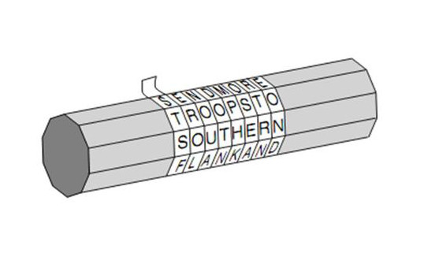

```{r setup, include=FALSE}
knitr::opts_chunk$set(echo = TRUE)
```

```{r load-libraries, echo=FALSE, include=FALSE}
library(ggplot2)
library(ggthemes)
library(knitr)
library(kableExtra)
library(dplyr)
```


# Introduction  
  Cryptography has been around for centuries and is a form of communication. The simplest definition of cryptography is the art of creating and interpreting secret messages. Creating a secret message is called "encrypting" and interpreting a secret message is called "decrypting." 
  
# Ancient History of Cryptography  

## Caesar's Cipher

  One of the oldest and most famous methods of cryptography is known as Caesar's Cipher and it was used in the first century B.C. by Julius Caesar[@leftonNumberTheoryPublicKey1991]. Caesar's Cipher is known as a "substitution cipher" or a "monoalphabetic cipher." This cipher is just a shifting of the alphabet. First, the numbers 0-25 are assigned to the alphabet respectively. Then, the encrypter will choose a shift value. Suppose the shift is $n = 2$. Each letter in the alphabet will shift 2 units to the right. A will become 2, B will become 3, C will become 4, and so on. Using modular arithmetic, this can be explained using an encryption function, $E_n(x) = x+n(mod \:26)$, where $x$ is the numerical value of the letter and $n$ is the shift value. 

After encrypting the message and sending it, decrypting the new message is just as simple. All the receiver needs is the key to unlocking the message, the shifting value, $n$. To decrypt, the receiver uses the decrypting function $D_n(x) = x - n (mod\:26)$. 
 
Suppose I want to encrypt the word "CRYPTOGRAPHY" to send to a classmate using a shift value of $n = 5$. First, I plug the numerical value of each character in the string "CRYPTOGRAPHY" into the encrypting function, $E_n(x) = n + x (mod\:26)$. 

```{r caesar-cipher, echo = FALSE}
# load data
caesar <- readRDS("./data/caesar.rds")
# display
kableExtra::kbl(caesar, booktabs = T, caption = "Caesar's Cipher 5 Unit Shift") |>
    kable_styling(latex_options = c("striped", "scale_down", "hold_position")) |>
    column_spec(2, color = c("red", "black")) |>
    column_spec(7, color = c("black", "red"))
```


  Now, the encrypted message will read the character string, "HWDUYTLWFUMD." To decrypt, the classmate will use the key of $n = 5$ along with the decrypting function $D_n(x)= x-n(mod\:26)$ to reverse the shift and read "CRYPTOGRAPHY." However, if the message is intercepted, cracking the encrypted message would take little time even without the key. There are only 26 possible combinations of what the shift could be. Over time, the process of creating more secure encryption methods has become much more complex yet Caesar's Cipher remains a foundational model of how cryptography works. 
  
## Spartan Scytale 

The Spartan Scytale is a type of transposition cipher dating back to the fifth century B.C. used by the ancient Greeks in times of war.[@singhCodeBookScience2011] A transposition cipher is one in which the ordering of the message is changed by a certain rule. The spartan scytale was created using a wooden shaft with a thin strip of leather wrapped around it. The sender would write his message onto the leather strip and then unwrap it from the wooden shaft. Once he unwrapped the leather strip with the new message on it, the message would become encrypted. Once received, the receiver would then wrap the strip of leather around a wooden shaft of the same width to decrypt the message. 

```{r spartan-scytale, echo=FALSE, fig.cap="Spartan Scytale[2]", out.width="80%", fig.align='center'}

```
  
# Contemporary Cryptography 

## Diffie-Hellman

Since the origination of secret messages, the challenge was for the sender and receiver of the message to have the same key for encoding and decoding a message. According to Auguste Kerckhoffs, one of the main principles of cryptography is the security of a cryptosystem should rely on the secrecy of a small parameter, the secret key.[@leftonNumberTheoryPublicKey1991] 
The process of "key distribution" required the delivery of the key to the receiver of the message. If the receiver did not have the key value for Caesar's Cipher, they could not read what it said. In modern times, all countries rely heavily on the security of information via cryptography. As trade between countries increased post World War II, it required payments to be made across borders and sometimes at great distances.[@singhCodeBook1999]  The cost associated with the delivery of keys became prohibitive and countries began to investigate how to make the process more efficient.  The solution that had evaded discovery for centuries was first proposed by two Americans: Whitfield Diffie and Martin Hellman in 1976 in their paper, *New Directions in Cryptography*.[@diffieNewDirectionsCryptography2022] Their idea was to have an "asymmetric public-private key." This discovery is considered "to be the greatest cryptographic achievement since the invention of the monoalphabetic cipher over two thousand years ago."[@singhCodeBook1999]

<!-- ## Asymmetric public-private Keys -->

<!-- Diffie considered the situation where two people on the internet need to keep a message (e.g. e-mail) or a transaction private. The two parties need to share a key, but exchanging the key securely became a problem.  The volume of messages and transactions made the physical delivery of the key impractical. Without secure encryption, communication would be impossible because messages and credit card information could be discovered. At a talk at IBM, Diffie learned that a Stanford University professor was also interested in the problem, Martin Hellman. In 1974, he received a call from Whitfield Diffie and agreed to a half-hour meeting at his office.  The half-hour meeting turned into hours with Diffie leaving Hellman's home at midnight.  The two formed a partnership with another cryptography fanatic, Professor Ralph Merkle, to address the key distribution problem.[@singhCodeBook1999] -->   
## Asymmetric Keys  
Asymmetric cryptography, also called "public key cryptography" relies on two parties and four keys. Each party has a private key and a public key. The private key must be kept private, but the public key can be distributed to anyone that requests it. The public key is used for encrypting a message, and the private key is used for decrypting a message. When one party encrypts and sends a message, the other party must have a key that is related, yet different to decrypt the message.

## Asymmetric Key Example 

Examples from cryptography involve a traditional cast of characters: Alice, Bob, and Eve. Alice and Bob wish to exchange a secure message while Eve wishes to eavesdrop and steal the message. Before Diffie-Hellman, Alice and Bob would have to meet to exchange keys. If they were exchanging lots of messages or wanted to change encryption methods, they might have to meet weekly. The system breaks down when one of them gets sick. Couriers could help but they also add complexity and potential insecurity to the process.[@singhCodeBook1999]

Let's envision a situation where Alice puts her message in a box and then locks it with a key. Alice then keeps the key. When Bob receives the message, he has no way to open the lock. Bob needs the key that Alice retained. This is essentially the age-old problem but restated. Diffie-Hellman changed the way the problem was conceived. Instead, they described this situation.  Alice locks the message in a box with her lock, retaining the key, and sends the box to Bob. Bob then takes the box, adds his lock with his key, and returns the box to Alice. Alice receives the box but it now has two locks. She takes her lock off the box, leaving only Bob's lock. She then sends the box back to Bob and Bob receives the box with only his lock. He removes the lock with the key he retained and can finally read the message. No key was exchanged between the two.[@singhCodeBook1999] In this example, the keys of Alice and Bob represent the private keys, and their locks represent the public keys. 

Diffie-Hellman's contribution was to propose a theoretical method whereby an encrypted message could be exchanged without the need for exchanging the keys. The use of keys is asymmetric in that Alice's padlock key (the key that encrypted the message) is different from Bob's padlock key (the key that decrypted the message). The discovery was "revolutionary"[@singhCodeBook1999] and forever changed the future of cybersecurity. Their research left unresolved how the encryption was to occur. They needed a mathematical function that was easy to encrypt but impossible for an eavesdropper to decipher.


## Trapdoor Encryption

To turn the concept of asymmetric ciphers into a practical invention, a mathematician needed to create a function that acted as a lock.  Some mathematical functions are considered to be two-way functions in that they are easy to do and undo. They act like a light switch where the effort to turn the switch on is the same as turning it off.  For example, doubling a number takes the same effort as dividing a number by two. Diffe and Hellman were not interested in two-way functions, but instead, were looking for a one-way or "trapdoor" function.[@singhCodeBook1999] A trapdoor function is one where it was possible to apply a function to a number but much harder to reverse.  These kinds of functions are sometimes described as "Humpty-Dumpty" functions because it's easy to get Humpty-Dumpty up on the wall, but hard to put him back together after he falls.[@singhCodeBook1999] Diffe-Hellman would attempt to find a solution in modular arithmetic, but the one-way mathematical encryption would ultimately be solved by another group of mathematicians.[@singhCodeBook1999]

A workable trapdoor mathematical function would be discovered by Ron Rivest, Adi Shamir,
and Leonard Adleman. (The initials of their surnames form the acronym “RSA”.) The three
researchers were inspired by New Directions in Cryptography and set off on the hunt to further the findings of Diffie and Hellman. In 1977, the three presented a trapdoor function and practical implementations in their paper, *A method for
obtaining digital signatures and public-key cryptosystems.*[@acmRonaldRivestTuring2002] At the time, Adleman thought
it would be the “least interesting paper” that he ever authored.[@singhCodeBook1999] The system “went on to
become the most influential cipher in modern cryptography.”[@singhCodeBook1999]

## Dual Discoveries

Asymmetric encryption was discovered earlier in Great Britain by James Ellis who worked for the Government Communications Headquarters, but knowledge of the discovery was delayed because of national security.[@singhCodeBook1999] Ellis was a packrat of academic articles and discovered the idea in a trove of old telecommunications articles. A paper proposed the idea of adding noise to the telephone line to make the signal unintelligible. The recipient would then remove the noise to hear the message. Lacking the mathematical background to create a padlock, Ellis' discovery languished until a new mathematician joined the team. Clifford Cocks, a recent graduate of Cambridge with a specialization in number theory, discovered a one-way function.  In recalling his epiphany, he said "it was natural to think about one-way functions, something you could do but not undo. Prime numbers and factoring was a natural candidate."[@singhCodeBook1999] From start to finish, Cocks estimated that it took him no more than half an hour to solve. [@singhCodeBook1999]
  
  
# The RSA Algorithm

Cryptography has become more important as we communicate globally with the internet. The sharing of credit card numbers, social security numbers, names, etc. online is an everyday occurrence, and security for our information is a necessity. RSA cryptography is one solution protecting us from those who wish to steal our information. The RSA algorithm can be broken up into 7 steps. Steps 1-5 are for key generation, step 6 is encryption, and step 7 is decryption. 


Step 1: Find two large primes, $p_0$ and $p_1$, such that their product, $n$, is of the required bit length. The length of $n$ (the "modulus") will usually be of the standard 1024, 2048, or 3027 bits.[@technologyDigitalSignatureStandard2013] Respectively, this is about 308, 616, and 911 digits. 

Step 2: Calculate $n= p_0\cdot p_1$ and use Euler's totient function to calculate $\phi(n) = (p_0-1)\cdot (p_1-1)$.  

Step 3: Choose some integer $e$ such that $(e,\phi(n)) = 1$ where $1<e<\phi(n)$.

Step 4: Calculate $d$, the multiplicative inverse of $e(mod\:\phi(n))$. i.e. $d\equiv e^{-1} (mod\:\phi(n))$

Step 5: Key generation is finished. The "public key" is now $(n, e)$ and the "private key" is $(n, d)$.  

Step 6: Encrypt the message using $C\equiv M^e(mod\:n)$ to calculate the least residue $(mod\:n)$. $C$ stands for the ciphertext and $M$ stands for the original message. 

Step 7: Decrypt the ciphertext using $M\equiv C^d(mod\:n)$ to calculate the least residue $(mod\:n)$.


# Finding Large Primes

Calculating large primes for $p_0$ and $p_1$ is one of the "easier" parts of the key generation algorithm. The goal is to calculate $n$, the product of $p_0$ and $p_1$. $p_0$ and $p_1$ are very large: at least 512 digits, but 1024 digits is considered safe.[@steynHowRSAWorks]  

Finding large primes relies on a process called "primality testing." A primality test is an algorithm that determines whether a number is prime or composite. There are several primality tests in existence. The most common primality test for RSA cryptography is the Rabin-Miller which is based on Fermat's Little Theorem. In this paper, I will cover two primality tests: the trial division test and the Fermat primality test. However, the Fermat test, just like the Rabin-Miller, is a *probability* test for efficiency purposes. The test calculates numbers that are highly probable candidates for being prime based on the characteristics of prime numbers. 

### Theorem 5.1: {-}

If $n \in \mathbb{Z^+}$ such that $n$ has no prime divisor $p \leq \sqrt n$, then $n$ is prime.  

### Theorem 5.2: Unique Factorization Theorem {-}

Every natural number $n>1$ can be uniquely expressed as a product of primes. i.e. $n=(p_1^{e_1})(p_2^{e_2})(p_3^{e_3})...(p_k^{e_k})$ for distinct primes $p_i$ and positive integers $e_i$ with $1\le i\le k$.  

### Primality Test 5.3: Trial Division Test {-}

Suppose we want to test whether $n$ is prime. Check whether each prime that is $\leq \sqrt n$ divides $n$. If one of the primes divides $n$, then $n$ is composite. If not, then $n$ is prime. 


### Lemma 5.4: {-}

If $a$ and $m$ are relatively prime integers, then the least residues of $a, 2a, 3a,...,(m-1)a$ $(mod\:m)$ are equivalent to $1, 2, 3,..., (m-1)(mod\: m)$, up to reordering. 


### Theorem 5.5: Fermat's Little Theorem {-}
If $p$ is a prime and $a$ is an integer such that $(p, a) =1$, then $a^{p-1}\equiv 1 (mod\: p)$. 


##### Proof of Fermat's Little Theorem: {-} 
Let $p$ be a prime and $a\in \mathbb{Z}$ such that $p\nmid a$.
Thus $a$ and $p$ are relatively prime, i.e. $(a,p) = 1$.
Hence, by the Lemma 5.4, $a, 2a, 3a,..., (p-1)a(mod \: p)$ have the least residues of $1, 2, 3,..., p-1(mod\: p)$ up to reordering.  

Thus,
$$
\begin{aligned}
a\cdot 2a\cdot 3a \cdots(p-1)\cdot a &\equiv 1\cdot 2\cdot 3\cdots(p-1)(mod \:p) \\
&\equiv (p-1)! \\
&\equiv -1(mod\: p) \quad \textrm{by Wilson's Theorem.}
\end{aligned}
$$
Note that $a\cdot 2a\cdot 3a ...(p-1)\cdot a = a^{p-1}\cdot (p-1)!$. Thus, $a^{p-1}\cdot (p-1)! \equiv a^{p-1}\cdot (-1) \equiv a \cdot2a\cdot3a\cdots(p-1)a \equiv (-1)(mod\: p)$.  

By definition of multiplicative inverse, $(-1)^{-1} \equiv (-1) (mod\: p) \equiv (p-1) (mod\:p)$.
Hence,
$$
\begin{aligned}
1 &\equiv (-1)\cdot  (-1) \\
&\equiv (-1)\cdot a^{p-1}\cdot (p-1)! \\
&\equiv (-1)\cdot a^{p-1}\cdot (-1) \\
&\equiv a^{p-1} (mod\: p).
\end{aligned}
$$  


### Definition 5.6: Carmichael Number {-} 
A Carmichael number is a composite number $n$ that satisfies $a^{n-1} \equiv 1(mod\:n)$ for all $a$ with $(a,n)=1$.[@weissteinCarmichaelNumber]

### Primality Test 5.7: Fermat Primality Test {-} 
Suppose we want to determine whether an integer $n \geq 2$ is prime. Iterate the sequence $t$ times as follows:\hfill\break
1. Pick an integer $a$ such that $2 \leq a \leq n-1$. \hfill\break
2. Check if $a^{n-1} \equiv 1 (mod\:n)$. \hfill\break
3. If $a^{n-1} \not\equiv 1 (mod\:n)$, then stop the test and declare $n$ as composite.  
4. If $a^{n-1} \equiv 1 (mod\:n)$ then repeat step 1.  
5. If the test runs $t$ times without terminating, then $n$ is prime or Carmichael with probability greater than $1-1/2^t$.[@conradFermatTest]


#### Example 5.8: Fermat Primality Test{-}  

Suppose we wish to determine if 561 is prime. 
1. Set $t=5$ and let $a=2$. Then, $2^{560} \equiv 1 (mod\:561)$, so pick another $a$ for step 1. \hfill\break
2. Let $a=3$. Then, $3^560 \equiv 375 (mod\:561)$. \hfill\break
Thus, 561 is composite.  

#### Example 5.9: Fermat Primality Test {-}

Suppose we wish to determine if 127 is prime.  
1. Set $t=5$ and let $a=2$. Then, $2^{126} \equiv 1 (mod\:127)$, so pick another $a$ for step 1.  
2. Let $a=3$. Then, $3^{126} \equiv 1 (mod\:127)$, so pick another $a$ for step 1.  
3. Let $a=4$. Then, $4^{126} \equiv 1 (mod\:127)$, so pick another $a$ for step 1.  
4. Let $a=5$. Then, $5^{126} \equiv 1 (mod\:127)$, so pick another $a$ for step 1.  
5. Let $a=6$. Then, $6^{126} \equiv 1 (mod\:127)$.\hfill\break Thus, the test concludes that 127 is prime or Carmichael with probability greater than $1-1/2^5 = .96875$.


Once two primes are found using a primality test, multiplying them together yields $n$, the modulus used in each of the key pairs. The reason for doing this is to create the trapdoor function. A trapdoor function that multiplies these two primes takes a little time, but doing the inverse to find the original primes takes much longer. 

For example, say the two prime numbers I picked were 257 and 331. Then, computing $n=(257)(331)=85,067$ takes no time at all. Now consider going in the other direction. If I gave you the product of 85,067 to begin with and asked you to find the two primes I multiplied together to get this number, then this process becomes much more time-consuming. Going in one direction was easy, but going in the other direction was much more difficult. The same difficulty goes for computers. This is the beauty of RSA encryption. Algorithms can be ranked by their efficiency. In the example above, 257 and 331 are incredibly small primes relative to the primes used for RSA encryption. Multiplying two of these large numbers still takes a small amount of time and computational resources. However, factoring $n$ requires a much more complex algorithm. In fact, recovering a prime number of 1024 bits would require a year's worth of work on a $10 million machine, and recovering a prime number of 2048 bits would require several billion times more work.[@jahanImprovedRSACryptosystem2015] However, this process is theoretically possible due to the Unique Factorization Theorem. 

# Using Euler's Totient Function 


### Definition 6.1: Euler's Totient Function {-}

If $n \in \mathbb{Z}^{+}$, Euler's totient function, $\phi(n)$, is defined to be the number of positive integers less than or equal to $n$ and relatively prime to $n$.[@dudleyElementaryNumberTheory2008]

### Theorem 6.2: {-}

Let $n$ have the prime power factorization $(p_1^{e_1})(p_2^{e_2})(p_3^{e_3})...(p_k^{e_k})$ for distinct primes $p_i$ and positive integers $e_i$ with $1\le i\le k$. Then,  
$$
\begin{aligned}
\phi(n) = \prod_{i=1}^{k} \phi(p_i^{e_i})= \prod_{i=1}^{k} p_i^{e_i-1}(p_i-1). 
\end{aligned}
$$


### Lemma 6.3 {-}

For a prime $p$ and a positive integer $k$, 
$$
\begin{aligned}
\phi(p^k)=p^{k-1}\cdot (p-1).
\end{aligned}
$$  
  
#### Proof of Lemma 6.4:  {-}

Let $p$ be a prime and let $k \in \mathbb{Z^+}$. There are $p^k$ positive integers that are less than or equal to $p^k$. Of these positive integers, the only numbers not relatively prime to $p^k$ are the multiples of $p$. i.e. $(1)p, (2)p, (3)p,..., (p^{k-1})p$. Thus, there are $p^{k-1}$ positive integers less than or equal to $p^k$ that are not relatively prime to $p^k$. Therefore,
$$
\begin{aligned}
\phi(p^k)&=p^k-p^{k-1} \\
&=p^{k-1}(p-1).
\end{aligned}
$$  

### Corollary 6.5:  {-}

Euler's totient function is multiplicative.  

#### Proof of Corollary 6.5:  {-}

Suppose $n \in \mathbb{Z^+}$. Then $n$ has a unique prime power factorization by the Unique Factorization Theorem. Let $n=(p_1^{e_1})(p_2^{e_2})(p_3^{e_3})...(p_k^{e_k})$ for distinct primes $p_i$ and positive integers $e_i$ with $1\le i\le k$. Let $a=(p_1^{e_1})(p_2^{e_2})(p_3^{e_3})...(p_l^{e_l})$ and $b=(p_{l+1}^{e_{l+1}})(p_{l+2}^{e_{l+2}})...(p_k^{e_k})$ where $l \in \mathbb{Z}$ and $1 \leq l <k$. Then, $n=ab$ and $(a,b)=1$.  Then $\phi(a)= \prod_{i=1}^{l} p_i^{e_i-1}(p_i-1)$ and $\phi(b)= \prod_{i=l+1}^{k} p_i^{e_i-1}(p_i-1)$ by Theorem 6.4. Thus,
$$
\begin{aligned}
\phi(a)\cdot \phi(b) &= \prod_{i=1}^{l} p_i^{e_i-1}(p_i-1) \cdot \prod_{i=l+1}^{k} p_i^{e_i-1}(p_i-1) \\
&= \prod_{i=1}^{l} p_i^{e_i}(1-\frac{1}{p_i}) \cdot \prod_{i=l+1}^{k} p_i^{e_i}(1- \frac {1}{p_i}) \\
&= a\prod_{i=1}^{l} (1-\frac{1}{p_i}) \cdot b\prod_{i=l+1}^{k}(1- \frac {1}{p_i}) \\
&= ab \prod_{i=1}^{k} (1-\frac{1}{p_i}) \\
&= n \prod_{i=1}^{k} (1-\frac{1}{p_i})\\
&= \prod_{i=1}^{k} p_i^{e_i}(1-\frac{1}{p_i}) \\
&=\prod_{i=1}^{k} p_i^{e_i-1}(p_i-1) \\
&= \phi(n) \qquad \textrm{by Theorem 6.2}\\
&= \phi(ab).
\end{aligned}
$$

Therefore, Euler's totient function is multiplicative by definition. 

For the RSA algorithm, we are asked to calculate $\phi(n)$ where $n$ is the product of two primes $p_0$ and $p_1$. Since Euler's totient function is multiplicative, $\phi(p_0\cdot p_1)= \phi(p_0)\cdot \phi(p_1)$. Also, $p_0$ and $p_1$ have the unique prime power factorization of themselves. i.e. $p_0= p_0^1$ and $p_1=p_1^1$. Thus, $\phi(p_0)= (p_0-1)$ and $\phi(p_1) = (p_1-1)$. Therefore, $\phi(n)= (p_0-1)\cdot (p_1-1)$.

# Encryption and Decryption

After calculating $\phi(n)$ for the RSA algorithm, the next step is to find an integer $e$ between $1$ and $\phi(n)$ such that $e$ and $\phi(n)$ are relatively prime. $e$ is known as the "encryption exponent" that is used to generate the public key. The public key is the pair of positive integers $(e,n)$. The sender then uses the congruence $C\equiv M^e(mod \:n)$ to generate the ciphertext, $C$. Ciphertext is the encrypted message that hides the true meaning from anyone, other than the receiver, wishing to read the message.  

For the receiver to decrypt the message, the receiver needs to have the private key, the pair of positive integers $(d, n)$. $d$ can be derived by the receiver because $d$ is the multiplicative inverse of $e$. i.e. $d\equiv e^{-1} (mod\:n)$. With the private key, the receiver can then use the congruence $M \equiv C^d (mod\:n)$ to decrypt the message. Only the receiver knows the true values of $p_0$, $p_1$, and $\phi(n)$, so only the receiver can calculate the private key. The sender only has the public key.  

In summary, Alice wishes to send Bob a message. Bob follows steps 1-5 to generate his public and private keys. Anyone can see Bob's public key, but no one can see his private key. Alice uses Bob's public key to encrypt her message. Once Bob receives the ciphertext, Bob uses his private key to decrypt the message. 

# RSA Example 

One method of implementing the RSA algorithm would be using the "ASCII keyboard," the American Standard Code for Information Interchange. In this example, we will just focus on A-Z with their prescribed decimal values on the ASCII keyboard.  


```{r echo=FALSE}
ASCII <- readRDS('./data/ascii.rds')
ASCIItbl <- 
  ASCII|>
  dplyr::filter(Symbol %in% LETTERS) |>
  dplyr::select(DEC,Symbol) |>
  t()
library(kableExtra)
# display
kableExtra::kbl(ASCIItbl, booktabs = T, caption = "ASCII: A-Z") |>
    kable_styling(latex_options = c("striped", "scale_down", "hold_position")) 

```

Suppose Alice wishes to send the message "RSA" to Bob. She needs Bob's public key to do so. Alice needs to represent each value of "RSA" by a number between $0$ and $n-1$. [@rivestMethodObtainingDigital1978] For this example, we will use a message ($M_1$, $M_2$, and $M_3$) for each character. After conversion, R will now be $M_1 = 82$, S will be $M_2=83$, and A will be $M_3=65$.

First, Bob will select two primes (much smaller than the standard RSA). Suppose Bob picks $p_0=7$ and $p_1=13$.  

Next, calculating $n=p_0\cdot p_1$ yields $n= 7\cdot 13 = 91$. Then, with Euler's Totient Function, $\phi(91) = (6)\cdot (12) = 72$.  

Now, Bob chooses some integer $e$ such that $(e,\phi(n)) = 1$ where $1<e<\phi(n)$. Suppose Bob picks $e=23$. Now Bob has his public key that he broadcasts to Alice.

Next, Alice creates the ciphertext with $C\equiv M^e(mod \:n)$. 

$$
\begin{aligned}
C_1 \equiv 82^{23} \equiv 10 (mod\:91) \\
C_2 \equiv 83^{23} \equiv 34 (mod\:91) \\
C_3 \equiv 65^{23} \equiv 39 (mod\:91)
\end{aligned}
$$

Where $C_1$, $C_2$, and $C_3$ are the least residues $(mod \:91)$ of their respective messages. These are the messages that will be sent so that no one else can read what they say.  

Once Bob receives the message, Bob will then decipher the messages with the private key $(n, d)$ using the congruence $M \equiv C^d (mod\:n)$. To find $d$, Bob needs to calculate the multiplicative inverse of $23(mod\:72)$. Since $23\cdot 47 \equiv 1 (mod\:72)$, 47 is the multiplicative inverse.  

Then, to decipher, Bob will use the congruence $M \equiv C^d (mod\:n)$. 
$$
\begin{aligned}
M_1 \equiv 10^{47} \equiv 82 (mod\:91)  \\
M_2 \equiv 34^{47} \equiv  83(mod\:91) \\
M_3 \equiv 39^{47} \equiv 65(mod\:91)
\end{aligned}
$$

Now we have arrived back to our original numbers with their respective character values of "RSA."

# Next Generation in Encryption Standards

Because of advancements in computer technology, the next generation of encryption standards is currently under consideration by the National Institute of Standards and Technology ("NIST").

## NIST

The NIST is the premier, standard-setting organization in the U.S.  According to its website, the mission of the NIST is to "promote U.S. innovation and industrial competitiveness by advancing measurement science, standards, and technology in ways that enhance economic security and improve our quality of life."[@NIST2009] Originally founded in 1901, the NIST is a part of the U.S. Department of Commerce and has led the development of encryption standards.[@NIST2009] NIST technology secures tablets, cellphones, and ATMs; encrypts international transactions on the web; and protects U.S. federal information including those with national security implications. The NIST is constantly seeking better encryption standards as computational power increases.  

## RSA Factoring Challenge  

RSA Laboratories created the "RSA Factoring Challenge" in 1991 to encourage research into computational number theory and cracking RSA keys uses in cryptography.[@RSAFactoringChallenge2022] RSA laboratories offers cash prizes to those who manage to factor "semiprimes" (numbers that are the product of two primes) down to their prime factorizations used in generating RSA keys. The first challenge, named "RSA-100," was to factor a 100-digit (330-bit) number and was successfully completed in 1991.[@smartHistoryCryptographicKey2021] In 2020, the "RSA-250" was beaten and involved the factoring of a 250-digit (829-bit) number. Factoring the semiprimes used for the modulus in RSA has yet to occur, but will happen soon. 


## Quantum Computing

Quantum computing is the next generation in computer technology and harnesses the power of quantum mechanics. Classical computing does not have the computational complexity to factor large enough primes and break the security of RSA. It would take trillions of years for a classical computer to break an RSA-2048 bit encryption key.[@BreakingRSAEncryption]  However, quantum computing is a serious threat to the security of encryption. Once quantum computers are stable and large enough, quantum computers will be able to factor an RSA semiprime in the same amount of time that a classical computer can multiply the primes together. [@kirschQuantumComputingRisk2015]  

NIST's annual report, "[2021 Cybersecurity and Privacy Annual Report](https://bit.ly/3sLIzal)",
described the state of quantum computing and cryptography as follows:

> [T]here has been steady progress in building quantum computers – machines
that exploit quantum mechanical phenomena to solve problems that are difficult or intractable
for conventional computers. When the capacity to build large-scale quantum computers exists, they will be able to break many of the public-key cryptosystems currently in use. This weakness would seriously compromise the confidentiality and integrity of digital communications online and elsewhere.[@oreilly2021CybersecurityPrivacy2022]

An ominous prediction was offered within the report that current public key encryption systems will be obsolete within the next 20 years.

## Standardized Algorithm

The next generation of encryption standards is being considered by NIST and deemed a priority because of advances in quantum computing. To meet this new challenge, the NIST has held a public competition to analyze algorithms that will have the capability of protecting sensitive government information. The competition started in 2015 and is still narrowing down the candidate algorithms based on security, cost, performance, algorithms, and implementation characteristics.[@alagicStatusReportThird2022] According to the latest news release on July 5, 2022, NIST will recommend for most use cases the CRYSTALS-KYBER for key establishment.[@alagicStatusReportThird2022] The current status of the standard is maintained on the NIST [Post-Quantum Cryptography Project website](https://csrc.nist.gov/Projects/post-quantum-cryptography). In describing CRYSTALS-KYBER's performance, the NIST declared the public and cipher key size in the order of a thousand bytes (8000 bits) which should be acceptable for most applications.[@alagicStatusReportThird2022] The [conclusion](https://nvlpubs.nist.gov/nistpubs/ir/2022/NIST.IR.8413-upd1.pdf) was that "the security of KYBER  has been thoroughly analyzed and is based on a strong framework of results in lattice-based cryptography. KYBER has excellent performance overall in software, hardware, and many hybrid settings."[@alagicStatusReportThird2022]

# Conclusion  

One of the biggest pillars of cryptography, whether it be ancient or contemporary, is number theory. The main reason the security of RSA is exceptional is due to the inability of modern computers to factor large primes. However, throughout history, cryptanalysts (those who break into cryptosystems and decrypt messages) have always caught on to cryptographers (those who create hidden messages). RSA, with its encryption standards today, will eventually be insecure. However, number theorists around world will play a key role in developing new encryption standards for the betterment of cybersecurity and the future of RSA.  

\newpage

# References {-}

<div id="refs"></div>

\newpage

# Appendix A {-}

```{r primes, echo=FALSE}
#https://haozhu233.github.io/kableExtra/awesome_table_in_pdf.pdf
library(kableExtra)
primes <- readRDS("./data/primes.rds")
kableExtra::kbl(primes[1:50, ], 
                longtable = T, 
                booktabs = T,
                caption = "First 500 Primes") |> 
  kable_styling(latex_options = c("repeat_header"))

```

\newpage

# Appendix B {-}

```{r ascii, echo=FALSE}
#https://haozhu233.github.io/kableExtra/awesome_table_in_pdf.pdf
library(kableExtra)
ascii <- readRDS("./data/ascii.rds")
kbl(ascii, longtable = T, booktabs = T, caption = "US-ASCII Printable Characters") |> 
  kable_styling(font_size = 9, latex_options = c("repeat_header"))
```


<!-- \newpage -->

<!-- # Appendix C - Acronyms {-} -->

<!-- The list of acronyms was taken from NIST's *[Guideline for Using -->
<!-- Cryptographic Standards in the Federal Government: Cryptographic Mechanisms](https://nvlpubs.nist.gov/nistpubs/SpecialPublications/NIST.SP.800-175Br1.pdf)*. -->

<!-- ```{r acronym, echo=FALSE, eval=T} -->
<!-- library(kableExtra) -->
<!-- acronyms <- readRDS("./data/acronyms.rds") -->
<!-- kbl(acronyms, longtable = T, booktabs = T, caption = "NIST Cryptography Acronyms") |>  -->
<!--   kable_styling(latex_options = c("repeat_header")) -->

<!-- ``` -->


